# Local Environment Setup: Windows

Today, we'll be setting up our local development environment for Windows 10. For the Mac instructions, see [here](https://github.com/The-Marcy-Lab-School/local-environment-setup-mac).

## Table of Contents

0. [Set up Windows Subsystem for Linux (WSL)](#enable-wsl)
1. [Download VS Code for Windows and command line tools](#download-vscode-for-windows)
2. [Ensure you are using WSL2](#ensure-you-are-using-wsl-2)
3. [Install Node and NPM](#download-node-and-npm)
4. [Set up local Development directory](#set-up-local-development-directory)
5. [Configuring Github with your Terminal](#configure-your-github-using-the-terminal)

## Enable WSL

Within a few easy steps, you can get this done. Press **Windows Key + S** open up the search bar, and type “Windows Features.”

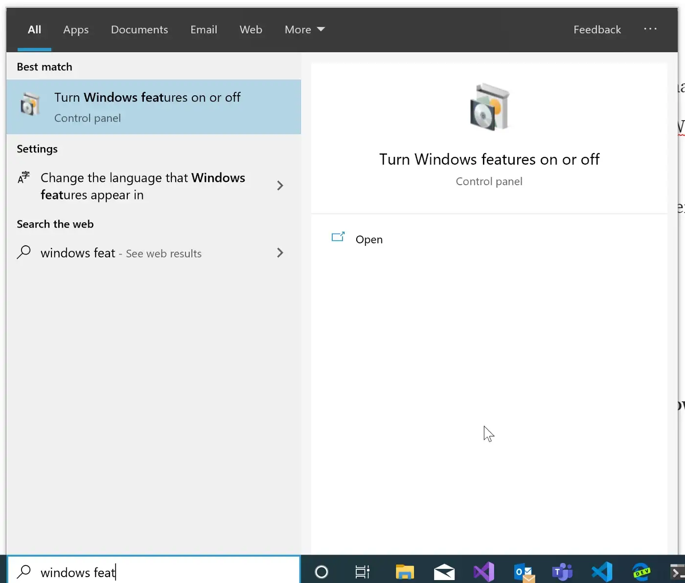

Click on the “Turn Windows features on or off”

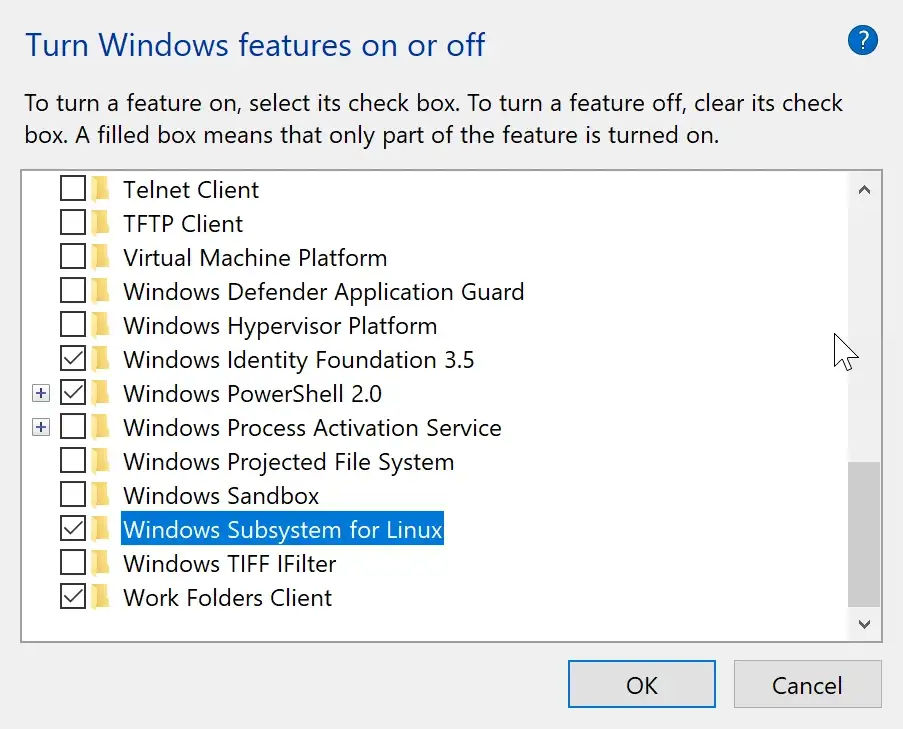

Select **Windows Subsystem for Linux** and click OK. (This will require a restart of Windows to get things installed).

After your computer stars up again, open the Windows Store (Microsoft Store) app and search for Ubuntu. You will get the **Ubuntu 20.04.05 LTS** in the Windows Store and then click Install to download. _Don't download the latest Ubuntu 22.04.01. That version may not be compatible with our environment setup. If you're not able to complete the steps before, you can simply delete 22.04.01 from your computer and install the 20.04.05 version._

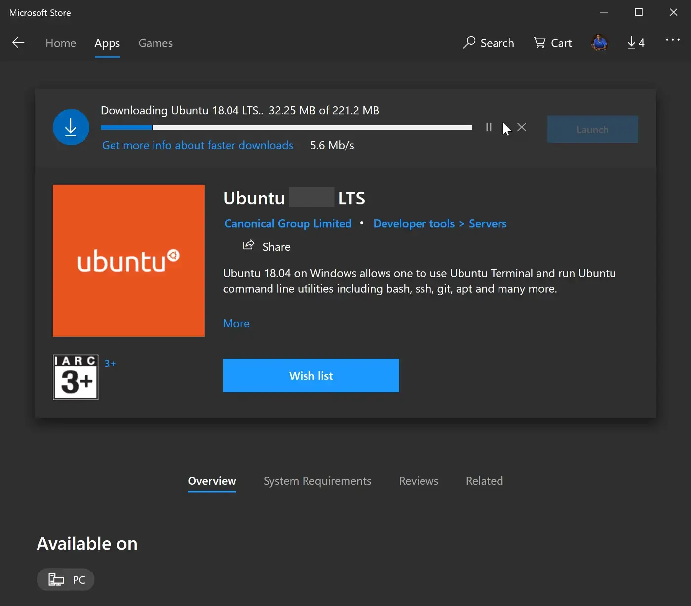

After installation, click the **Launch** button. For the first time, you see this screen that will require your attention to complete the installations. Press any key and wait for few seconds.

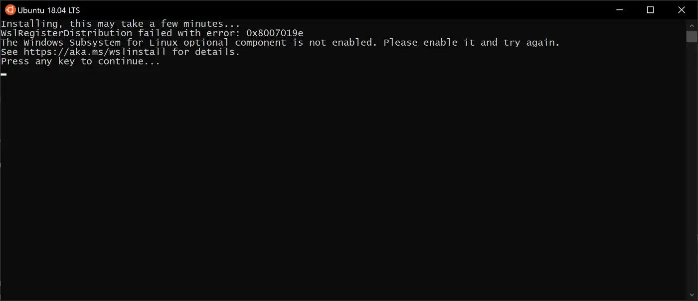

> From now on, we'll refer to your Ubuntu Terminal as just **Terminal** though other forms of documentation may refer to it as **WSL Terminal**.

Finally, you will have to give a **username** (must be lowercase) and **password** to complete the installation. Use your first name as a username and the password `marcy` for simplicity. Don't forget this!

If you ever forget your password to your Ubuntu terminal, you can read [these instructions](https://itsfoss.com/reset-linux-password-wsl/) to reset your password.

Now you are all good to go. Let's do a quick check in the terminal.

```
lsb_release -a
```

Executing the above command in your terminal will return an output of what version of Ubuntu you have. Your version may differ from what you see in the screenshot.

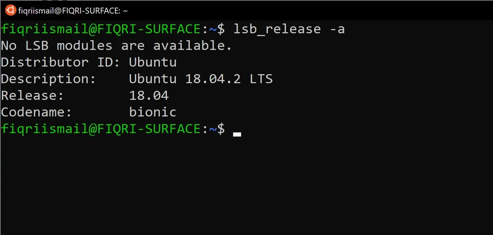

## Download VSCode for Windows

Visit [this web site](https://code.visualstudio.com/) and download VS Code.

Download the latest build and install it in your PC.

Now open VS Code. VS Code should automatically detect your WSL installation and suggest an extension.

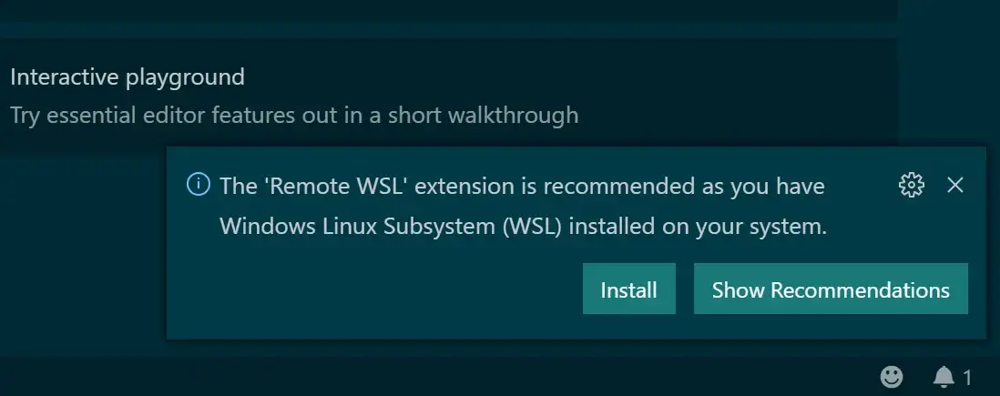

If not, you can click on the “Extensions” tab in VS Code. Search for "Remote - WSL" and install (I will have a penguin icon).

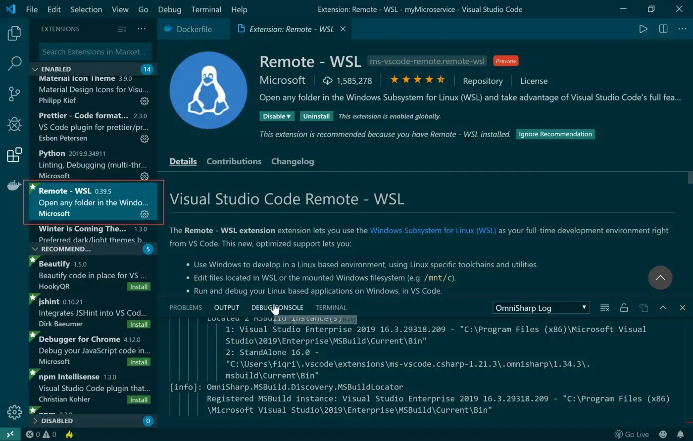

Excellent, we have done our VS Code setup. Close VS Code and go back to the WSL terminal app.

Type the following command

```
code .
```

This command will open up the VS Code from WSL. If this is the first time, the server will be setup for communication from WSL to VS Code. This is automatically done and you don’t need to worry about anything.

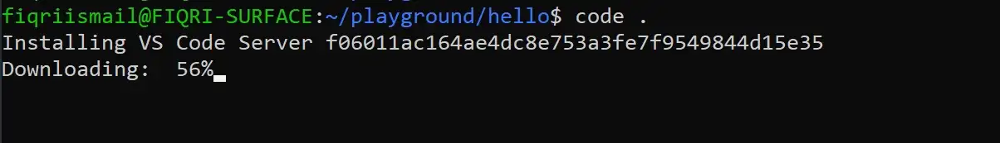

Visual Studio Code will open and will indicate its successfully connected to the server at WSL.

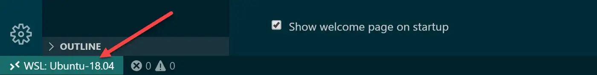

When you open the terminal from VS Code you will see the bash terminal at WSL.


You should pin Ubuntu Terminal and VS Code to the taskbar since you'll be using them a lot.


## Ensure you are using WSL 2

> Note: These instructions are based on Microsoft's documentation found [here](https://learn.microsoft.com/en-us/windows/wsl/install). The instructions published by Microsoft will always be more accurate than the instructions found below. As of 9/27/2023, the instructions below are accurate.

1. Open Powershell as Administrator. You can do this by right-clicking on Powershell and selecting "Run as Administrator" or by searching for Powershell in the Windows search bar and selecting "Run as Administrator".
2. Check the version of WSL by running `wsl -l -v` and take note of the value under `NAME` and `VERSION`
3. If the version is 2, you are good to go! You may close Powershell.
4. If the version is 1, you can change it to version 2 with a command like `wsl --set-version Ubuntu-22.04 2` where you would replace `Ubuntu-22.04` with the name listed under `NAME` from the command in step 2.
   - You should see "Conversion in progress, this may take a few minutes (it can take as long as 30 minutes or more)
   - If you see "Please enable the Virtual Machine Platform Windows feature and ensure virtualization is enabled in the BIOS." do the following:
     - In the Windows search bar, look for "Turn Windows features on or off"
     - Scroll down and select "Virtual Machine Platform" and then click "Ok"
     - Reboot your computer.
     - Re-open Powershell and return to step 2

## Download Node and NPM

> Note: These instructions are based on Microsoft's documentation found [here](https://learn.microsoft.com/en-us/windows/dev-environment/javascript/nodejs-on-wsl). The instructions published by Microsoft will always be more accurate than the instructions found below. As of 9/27/2023, the instructions below are accurate.

1. Go back to the Ubuntu terminal. Inside the terminal, type the following command and press enter:

```sh
curl -o- https://raw.githubusercontent.com/nvm-sh/nvm/master/install.sh | bash
```

2. Close the Ubuntu terminal and re-open it
3. Install the "Long Term Support" version of Node by entering the command `nvm install --lts`.
4. Confirm that you have Node installed by running the command `node --version` and you should see something like `v18.18.0` in response.
5. Confirm that you have `npm` installed by running the command `npm --version`, and you should see something like `9.8.1` in response.

You are now set up with Node and npm!

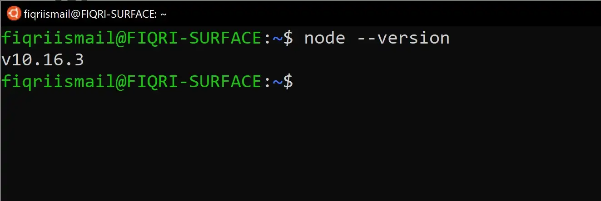

## Set up local Development directory

Every time you open your Terminal, you'll be in the home directory. Run `pwd` to see the current path. You'll see `home/your-user-name`.

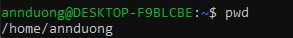

Using your Terminal as a command line, create a folder structure where you can put all your Marcy Lab code. We recommend:

```
development
 |- unit-0
 |- unit-1
 .....
 |- unit-7
 |- unit-8
```

You can do using the following commands:

- `cd` to navigate to the home directory.
- `mkdir development` to create a folder for _all_ your work.
- `cd development` where you will create more subdirectories.
- `mkdir unit-0 unit-1 unit-2` etc... to make multiple folders at once.
- `ls` to list the contents of `development/` and ensure the folders were created.

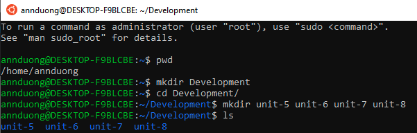

If you ever want to view these files on your computer in File Explorer, run the command `explorer.exe .` in your terminal. File Explorer will open your current working directory.

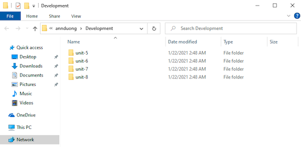

Next, ensure that you are in your `development` directory with the `pwd` command. Then, type the command `code .` into your terminal and it will open VS Code for you. You'll use this command a lot so remember it!

Familiarize yourself with VS Code. This will be your new coding environment.

- Your directories and files are in the left panel.
- You can start a new "VS Code Terminal" by selecting View > Terminal from the top menu bar.
- The "VS Code Terminal" works _exactly_ the same as your Ubuntu "Terminal"!

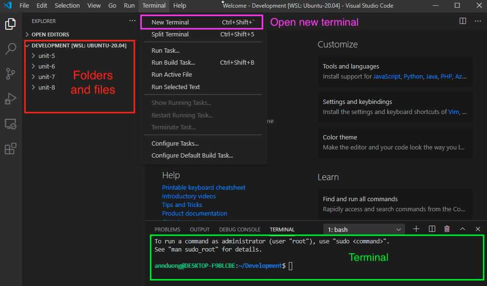

## Configure your Github using the Terminal

Follow these instructions to [set up Github in your terminal](https://github.com/The-Marcy-Lab-School/github-setup).

### If everything has worked as expected, reach out to an instructor for a final validation!
