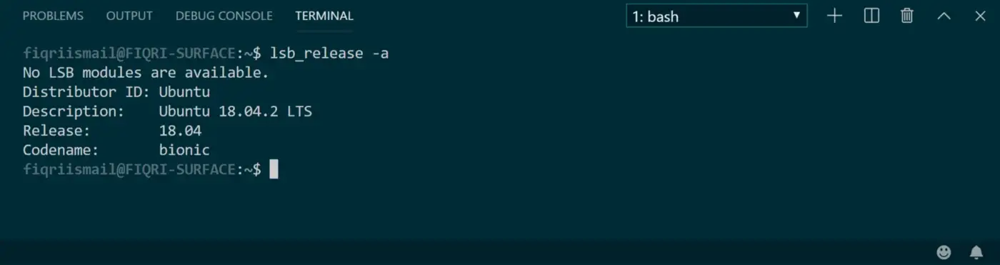

# Local Environment Setup: Windows

Today, we'll be setting up our local development environment for Windows 10. For the Mac instructions, see [here](https://github.com/The-Marcy-Lab-School/local-environment-setup-mac). 

## Table of Contents
0. Set up Windows Subsystem for Linux (WSL)
1. Download VS Code for Windows and command line tools
2. Install Node and NPM 
3. Set up local Development directory
4. Configuring Github with your Terminal
5. Add SSH Key for Github Setup

## Enable WSL 

Within few easy steps you can get this done. Press **Windows Key + S** open up the search bar, and type “Windows Features.”


Click on the “Turn Windows features on or off”


Select **Windows Subsystem for Linux** and click OK. (This will require a restart of windows to get things installed). 

After your computer stars up again, open the Windows Store (Microsoft Store) app and search for Ubuntu. You will get the **Ubuntu 20.04.05 LTS** in the Windows Store and then click Install to download. *Don't download the latest Ubuntu 22.04.01. That version is not compatible with our environment set up.*


After installation click the **Launch** button. For the first time you see this screen that will require your attention to complete the installations. Press any key and wait for few seconds. 


> From now on, we'll refer to your Ubuntu Terminal as just **Terminal**.

Finally you will have to give a **username** (must be lowercase) and **password** to complete the installation. You should use the same username and pasword as your computer so it's one less thing you have to remember!

If you ever forget your password to you Ubuntu terminal, you can read [these instructions](https://itsfoss.com/reset-linux-password-wsl/) to reset yoru password. 

Now you are all good to go. Lets do quick check in the shell.

```
lsb_release -a 
```
Executing above command in your temrinal will get an output of what you have. Your version may differ from what you see in the screenshot.


## Download VSCode for Windows

Visit [this web site](https://code.visualstudio.com/) and download VS Code.

Download the latest build and install it in your PC.

Now open VS Code. VS Code should automatically detect your WSL installation and suggest an extension.


If not, you can click on the “Extensions” tab in VS Code. Search for "Remote - WSL" and install (I will have a penguin icon).


Excellent, we have done our VS Code setup. Close VS Code and go back to the WSL terminal app.

Type the following command

```
code .
```
This command will open up the VS Code from WSL. If this is the first time, the server will be setup for communication from WSL to VS Code. This is automatically done and you don’t need to worry about anything.


Visual Studio Code will open and will indicate its successfully connected to the server at WSL.


When you open the terminal from VS Code you will see the bash terminal at WSL.



You should pin Ubuntu Terminal and VS Code to the taskbar since you'll be using them a lot. 


## Download Node and NPM

Now go back to Ubuntu. Inside the terminal type the following command and press enter.

```
curl -sL https://deb.nodesource.com/setup_18.x | sudo -E bash -
```
And then

```
sudo apt-get install -y nodejs
```

This will install NodeJS 10.x to your system. And to test your installation type the following command.

```
node --version
```

And you should get an output like this. Your version may differ from what you see in the screenshot.


## Set up local Development directory

Every time you open your Terminal, you'll be in the home directory. Run `pwd` to see the current path. You'll see `home/your-user-name`.


Using your Terminal as a command line, create a folder structure where you can put all your Marcy Lab code. We recommend:
```
Development
 |- unit-5
 |- unit-6
 |- unit-7
 |- unit-8
 |-      etc...
```
You can do using the following commands:
* `cd` to navigate to the home directory.
* `mkdir Development` to create a folder for *all* your work.
* `cd Development` where you will create more subdirectories.
* `mkdir unit-5 unit-6 unit-7 unit-8` to make multiple folders at once.
* `ls` to ensure the folders were created.


If you ever want to view these files on your computer in File Explorer, run the command `explorer.exe .` in your terminal. File Explore will open your current working directory.


Next, you should type the command `code .` into your terminal and it will open VS Code for you. Remember this terminal command in the future. It will be very helpful!

Familiarize yourself with VS Code. This will be your new coding environment. It is very similar to AWS Cloud 9 as long as you **open VS Code via the Terminal** from the **home directory** (you can always navigate to the home directory with `cd` and no path following the command). 

Your directories and files are in the left panel. You can start a new "VS Code Terminal" by selecting Terminal from the top menu bar. The "VS Code Terminal" works *exactly* the same as your Mac "Terminal" and your "AWS Cloud9 Terminal"!


## Configure your Github using the Terminal

Follow these instructions to [set up Github in your terminal](https://github.com/The-Marcy-Lab-School/github-setup).  

## Confirm that everything is working

At this point, you should be able to clone down, work on, and push back up to Github all of your code. Test all of the following: 

Using the terminal, `git clone` one of your old Problem Sets that have tests. Make sure your keep your directory structure clean. You should clone it in an appropriate folder. You can always run `pwd` and `ls` to check where you are. 

In the terminal, `cd` into the problem set you just cloned down. Run `npm install`, then run `npm test` to see the tests run. 

Make a minor change to the `README.md` file of your problem set, add and commit that change, and push it back to Github. Double check using the Internet browser that your change was pushed to the remote repo. 


### If everything has worked as expected, reach out to an instructor for a final validation!
